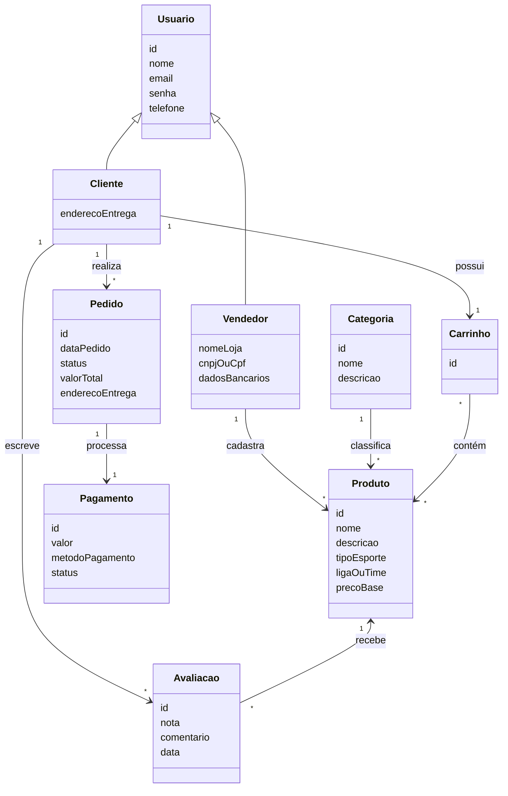

Modelagem de dados do site Camisa 12

```mermaid
classDiagram
    class Usuario {
        id
        nome
        email
        senha
        telefone
    }

    class Cliente {
        enderecoEntrega
    }

    class Vendedor {
        nomeLoja
        cnpjOuCpf
        dadosBancarios
    }


    class Produto {
        id
        nome
        descricao
        tipoEsporte
        ligaOuTime
        precoBase
    }

    class Categoria {
        id
        nome
        descricao
    }

    class Carrinho {
        id
    }

    class Pedido {
        id
        dataPedido
        status
        valorTotal
        enderecoEntrega
    }

    class Pagamento {
        id
        valor
        metodoPagamento
        status
    }

    class Avaliacao {
        id
        nota
        comentario
        data
    }

    Usuario <|-- Cliente
    Usuario <|-- Vendedor


    Vendedor "1" --> "*" Produto : cadastra
    Categoria "1" --> "*" Produto : classifica
    
    Cliente "1" --> "1" Carrinho : possui
    Cliente "1" --> "*" Pedido : realiza
    
    Pedido "1" --> "1" Pagamento : processa

    Cliente "1" --> "*" Avaliacao : escreve
    Produto "1" <-- "*" Avaliacao : recebe

    Carrinho "*"--> "*" Produto : contém
```
